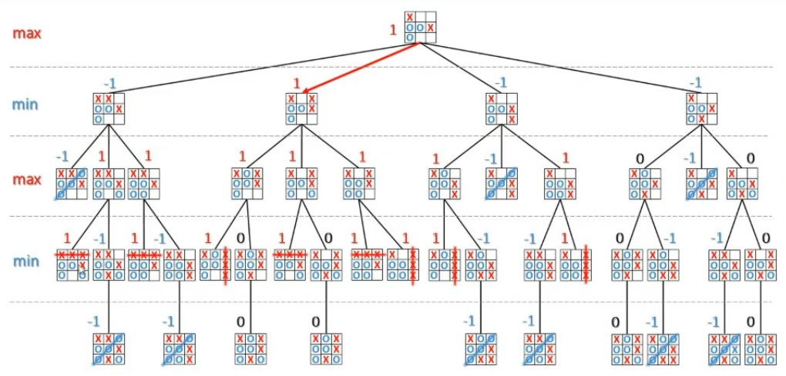
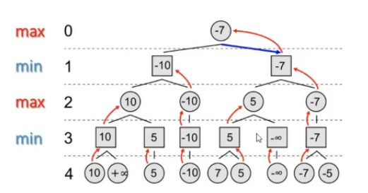

# Quarto

## Table of Contents
1. [Theory of games](#Theory)
2. [Example2](#example2)
3. [Third Example](#third-example)
4. [Fourth Example](#fourth-examplehttpwwwfourthexamplecom)

## Theory

https://github.com/yanntrividic/quarto-game
https://github.com/search?l=Jupyter+Notebook&q=quarto+game&type=Repositories
https://github.com/techwithtim/Python-Checkers-AI/blob/master/minimax/algorithm.py

Quarto è un board game di tipo
- finito: ovvero che esiste sempre almeno una combinazione per vincere/perdere o per finire in pareggio
- deterministico ovvero che gli stati del gioco sono determinati unicamente delle azioni dei giocatori
- diacrono/a turni ovvero che i due giocatori si alternano

Per un gioco combinatorio è possibile definire un albero di gioco in cui ciascun nodo `v` rappresenta uno stato di gioco (la radice è lo stato iniziale); ciascun arco `(u,v)` rappresenta invece uno stato lecito da `u` a `v`. 
I livelli si alternano secondo i turni:
- livello pari: turno giocatore A
- livello dispari: turno giocatore B

Le foglie sono gli stati terminali (vittoria/sconfitta di A o B o parità). Un cammino radice-foglia è una possibile partita (istanza) del gioco.

L'obiettivo è raggiungere uno stato terminale dell'albero con la massimizzazione dell'utilità (vincere in maniera schiacciante). Stiamo supponendo di giocare con `A`, se l'avversario inizia per primo, lui diventa `A` e noi `B`, con lo scopo di minimizzare l'utilità (far perdere A).
L'idea è definire una funzione di utilità dove ha valore, dato uno stato terminale:
- 0 se patta (foglia)
- 1 se A vince
- -1 se A perde (e B vince)

I numeri non devono essere per forza questi. 

Ipotizziamo che ogni turno A e B scelgono la loro mossa più conveniente, ovvero quella che li conduce a terminazioni migliori della partita. Alla fine del gioco è facile capire quali sono le mosse migliore. Da queste, possiamo risalire fino al nodo dello stato corrente. 
- se il livello è quello di A, etichetta il nodo con il `max` delle utilità dei figli
- se il livello è quello di B, etichetta il nodo con il `min` delle utilità dei figli. 

`A(B)` muove il figlio con utilità `max(min)`. 



Con il minmax ogni volta devo massimizzare la mia mossa o minimizzare quella avversaria.

L'algoritmo generale è un algoritmo ricorsivo 

```
minMaxMove(node u) -> son v:
    return argmax_v minval(v)

# se sono una voglia restituisco l'utilità, altrimenti calcolo il minimo
maxval(node u) -> real:
    if (u is leaf) return f(u)
    f(u) <- - infinte
    for each v in sons(u):
        f(u)=max{f(u),minval(v)}
    return f(u)


# Lo stato in cui mi trovo è una foglia? Se sì restituisco lo stato terminale, se invece non è una foglia
# devo minimizzare l autorità dei miei figli e la mia f(u) viene inizializzata con + infinito, per poi andare a cercare il minimo
# cerco quindi la più piccola utilità dei miei figli, che però sono avversari, quindi devo chiedere a maxval l'utilità 
minval(node u) -> real:
        if (u is leaf) return f(u)
    f(u) <- + infinte
    for each v in sons(u):
        f(u)=min{f(u),maxval(v)}
    return f(u)
```



L'algoritmo è una visita in profondità, in post ordine perché prima valuto i figli e poi valuto il resto. La complessità computazionale è quella pari a tutti i nodi dell'albero, idem la complessità spaziale. Se riusciamo a capire il numero di nodi, abbiamo caratterizzato le complessità. 

Dobbiamo applicare una tecnica di *cutoff* dove l'idea è quello di anziché espandere l'albero di gioco fino alle foglie, lo espando fino ad una certa profondità `d` a partire dal nodo corrente. Si valutano gli stati più profondi attraverso una funziona di valutazione `e(v)` e si propaga il risultato verso l'alto attraverso l'agoritmo Min-Max. 
Ad esempio, nel tris `e(v)=tris possibili per X - tris possibili per 0`. Se è positivo, allora ho possibilità per X, altrimenti per 0. In caso di uguaglianza a zero, allora ho una stessa probabilità.

Ovviamente nel caso del minmax, come faccio? Bisogna soddisfare dei requisiti:
- correttezza: deve essere consistente con la funziona di utilità `f(v)` se applicata agli stati terminali del gioco, ovvero deve indurre lo stesso ordinamento
- efficienza: deve essere veloce da calcolare, altrimenti sarebbe preferibile aumentare la profondità di ricerca
- precisione: deve riflettere la reale situazione del giocatore, ovvero essere proporzionale alle sue probabilità di vittoria

Può dipendere da una o più caratteristiche dello stato di gioco `v`.

Implementazione del cutoff

```
minMaxMove (node u, depth d) -> son v:
    return argmax_v minval(v,d)

maxval (node u, depth d) -> real:
    if (level(u)==d) return e(u)
    e(u)= - infinite 
    for each v in sons(u):
        e(u)=max{e(u),minval(v,d)}
    return e(u)

minval (node u, depth d) -> real:
    if (level(u)==d) return e(u)
    e(u)= + infinite 
    for each v in sons(u):
        e(u)=min{e(u),max(v,d)}
    return e(u)
```

La differenza è, la scelta di `d`
- pari: pessimista, valuta lo stato del gioco con `max` che deve fare una mossa, sto ignorando il vantaggio
- disapri: ottimista 
- più è grande d, più è accurata la stima (ma anche la difficolta)

In genere si sceglie, per vincere contro un umano, `d>5` che è il limite umano (statische...)

